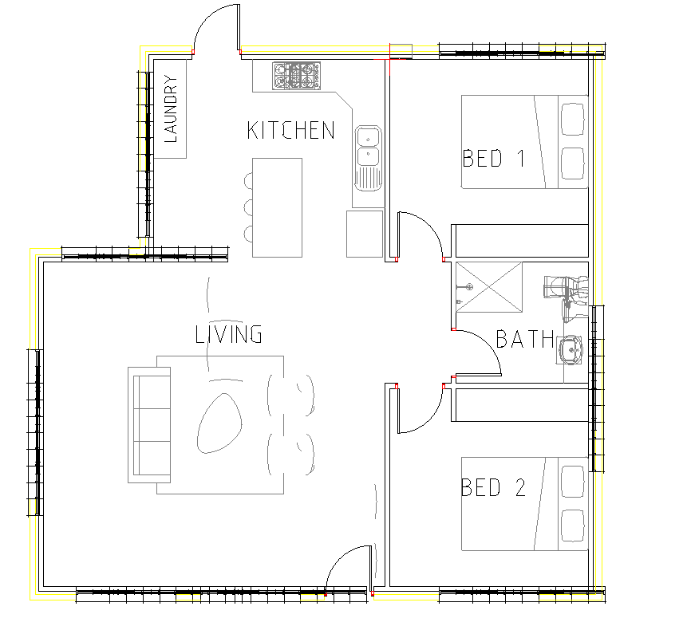
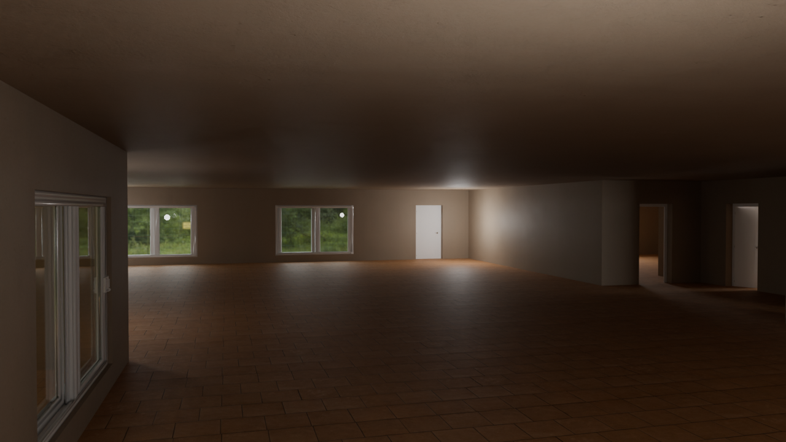
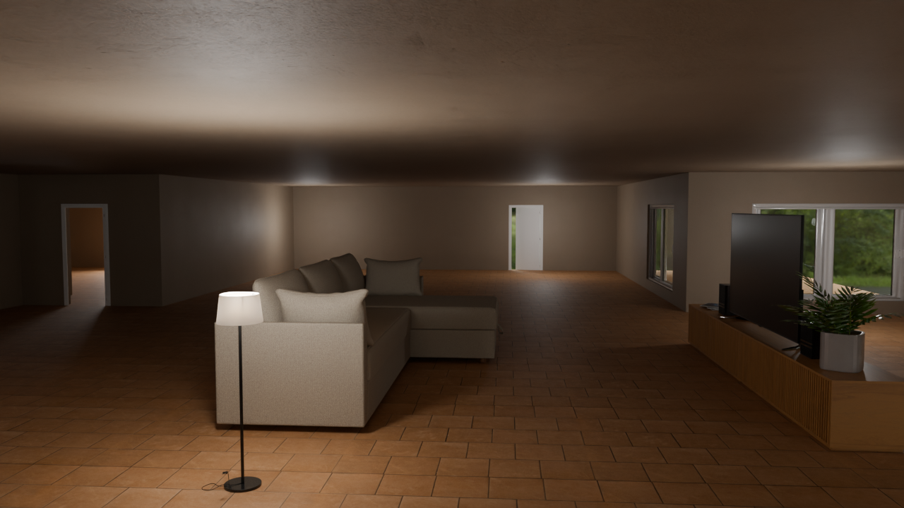
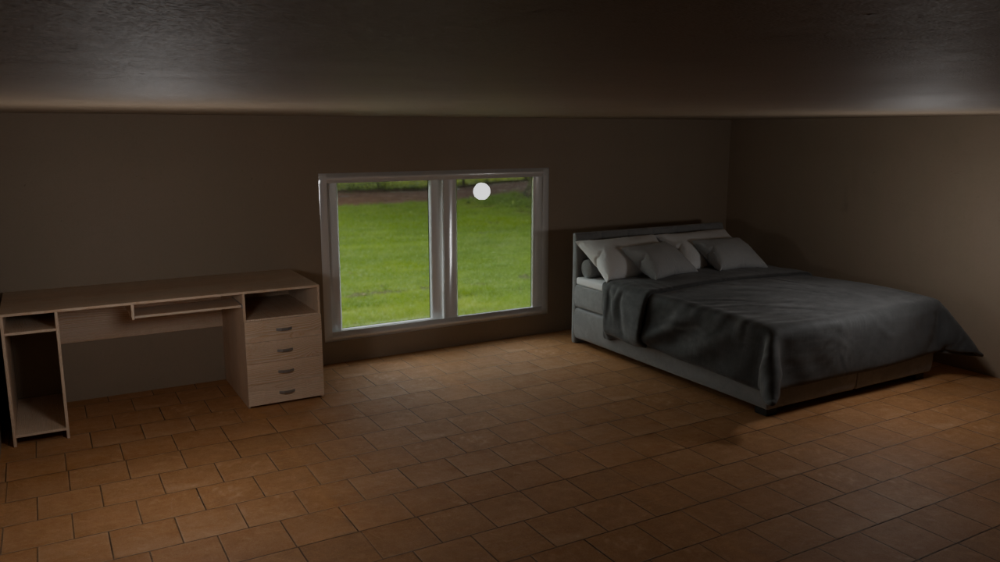
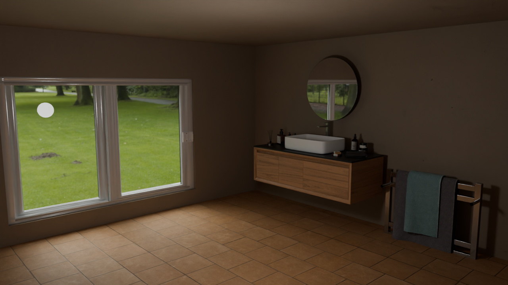
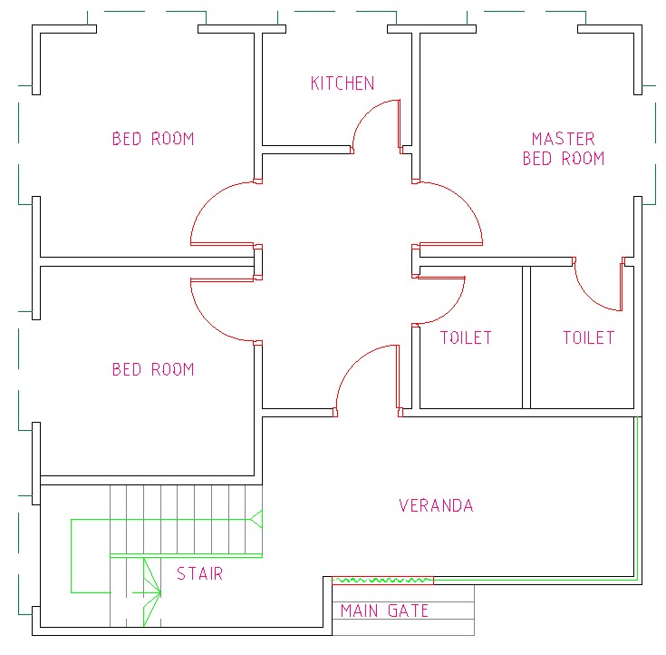
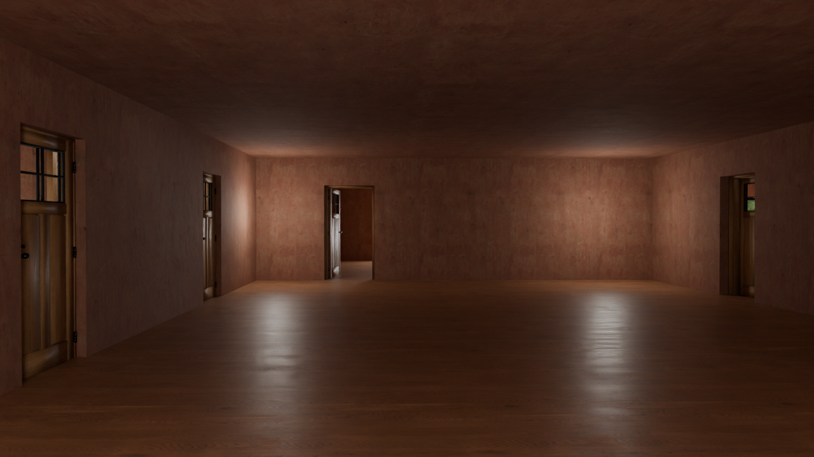
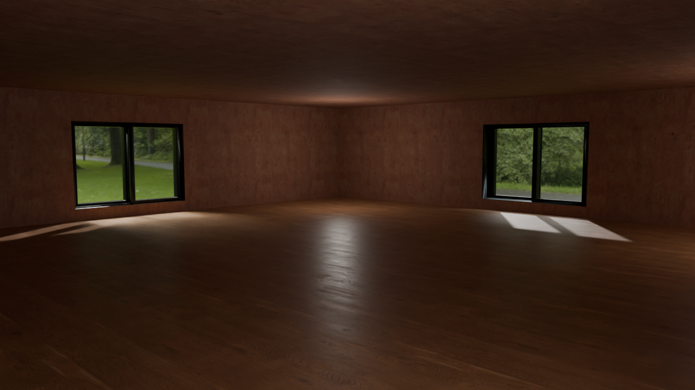
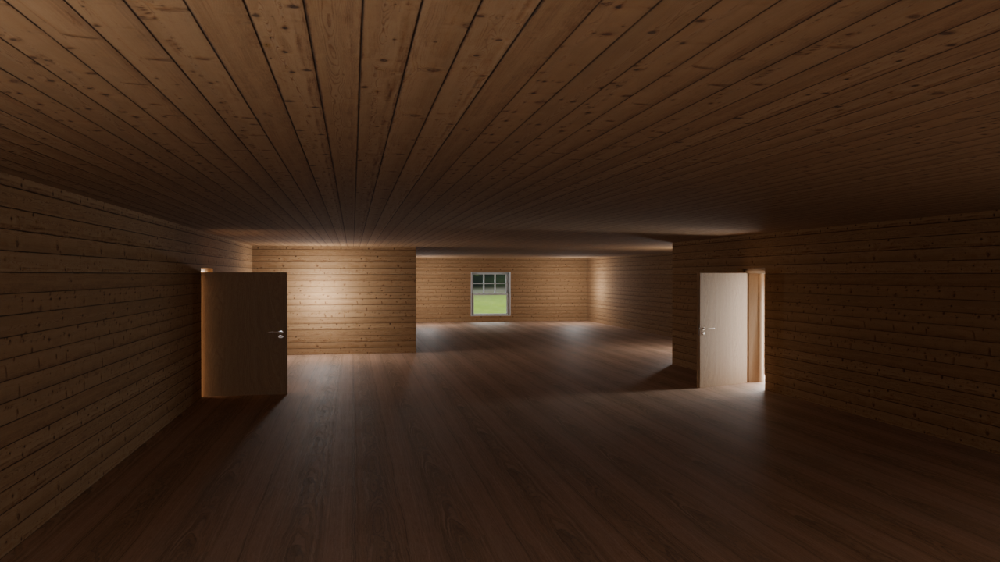

## Screenshots



















## Building

Install Conan package manager with pip:

```bash
pip install conan
```

Detect your system profile:

```bash
conan profile detect --force
```

Install dependencies and generate build files:

```bash
conan install . \
  --output-folder=build \
  --build=missing \
  -s build_type=Debug \
  -c tools.system.package_manager:mode=disabled
```

Configure CMake using the Conan toolchain:

```bash
cmake -S . -B ./build -DCMAKE_TOOLCHAIN_FILE=build/build/Debug/generators/conan_toolchain.cmake -DCMAKE_PREFIX_PATH=build/build/Debug/generators
```

Compile the project:

```bash
cmake --build ./build/ --parallel 8
```

## Run

Create a Python virtual environment
```bash
uv venv
```

Using the virtual environment:
```bash
source .venv/bin/activate
```

Install the required Python packages:
```bash
uv pip install -r requirements.txt
```

The C++ program reads all its parameters from a **JSON configuration file**.
Each CAD model requires its own configuration file, as parameters may vary depending on the drawing scale, geometry complexity, and desired output quality. Example:

```json
{
  "dxf_filename": "draftperson_Floor_Plan.dxf",
  "unit_scale": 0.01,
  
  "ceil_height": 3.5,
  "door_width": 1.2,
  "door_height": 2.1,
  
  "window_sill_height": 0.25,
  "window_height": 3.3,
  "window_width": 5.0,

  "snap_eps": 1e-2,
  "cluster_num_samples": 15,
  "cluster_eps": 2,

  "floor_texture_scaling": 2.0,
  "wall_texture_scaling": 2.0
}
```

- *dxf_filename*: path to the input DXF file.
- *unit_scale*: conversion factor from DXF drawing units to meters (e.g., 0.01 if the drawing is in centimeters).
- *ceil_height*: height of the ceiling in meters.
- *door_width*, door_height: target dimensions for doors.
- *window_sill_height*: distance from floor to window sill.
- *window_height*, window_width: target dimensions for windows.
- *snap_eps*: tolerance for vertex snapping (in meters).
- *cluster_num_samples*: minimum points for DBSCAN clustering.
- *cluster_eps*: maximum distance for DBSCAN clustering.
- *floor_texture_scaling*, wall_texture_scaling: scaling factors for UV coordinates to repeat textures.

```bash
./build/Floorplan3D cad/house_plan/Simple_House_Plan.json
```

To generate the blender file, run the following command:

```bash
python generate_blender_scene.py
```

Important: this script reads the JSON configuration file `blender_config.json` and generates a corresponding blender scene. Edit `blender_config.json` to customize the scene.
